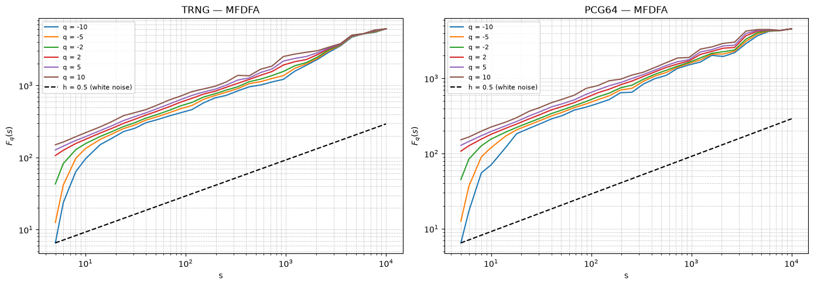
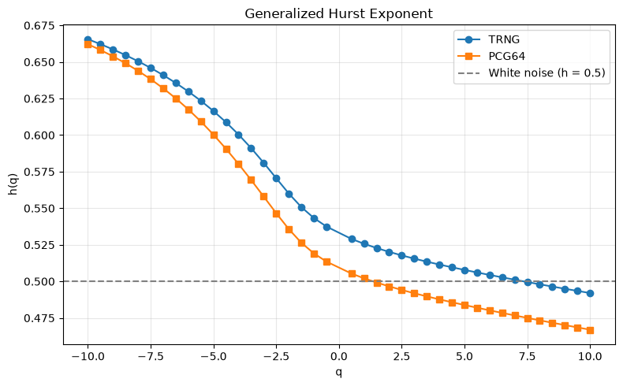

#+PROPERTY: header-args:python :kernel tutorials :async yes :results output :exports both
#+PROPERTY: header-args:python :session hello
#+PROPERTY: header-args:python+ :async yes

* MFDFA:QRNGs vs PRNGs

#+BEGIN_SRC python :kernel tutorials :tangle "mfdfa.py"
import os
import pandas as pd
import seaborn as sns
from scipy import stats
from scipy.stats import skew, kurtosis, wasserstein_distance, chisquare, norm
import matplotlib.pyplot as plt
from collections import deque
import numpy as np
import requests as re
from ast import literal_eval

from MFDFA import MFDFA
#+END_SRC

#+RESULTS:

** Project setup

#+BEGIN_SRC python :kernel tutorials :tangle "mfdfa.py"
PRNG = "pcg64"
PROJECT_ROOT_DIR = "./."
BASE_IMAGES_PATH = os.path.join(PROJECT_ROOT_DIR, "images", PRNG)
os.makedirs(BASE_IMAGES_PATH, exist_ok = True)

def save_figure(fig_id, image_path, tight_layout = True, fig_extension = "png", resolution = 300):
    path = os.path.join(image_path, fig_id + "." + fig_extension)
    print(f"Saving figure {fig_id}")
    if tight_layout:
        plt.tight_layout()
    plt.savefig(path, format = fig_extension, dpi = resolution)
#+END_SRC

#+RESULTS:

** Generators configurations

*** TRNG

#+BEGIN_SRC python :kernel tutorials :tangle "mfdfa.py"
class Qrng:
    def __init__(self, domain) -> None:
        self.__domain = domain
        self.__api_int = "https://{}/api/2.0/int".format(self.__domain)

    def qrand_int(self, low, hi, samples) -> list[int]:
        session = re.Session()
        payload = {"min": low, "max": hi, "quantity": samples}
        response = session.get(self.__api_int, params = payload)
        res = literal_eval(response.text)
        return res

def qrandint(l, h, n, pool_size = 100000) -> np.array:
    if not hasattr(qrandint, "ivalues"):
       qrandint.ivalues = {}

    key = str(l) + str(h)
    if key in qrandint.ivalues:
        # found the key
        values = qrandint.ivalues[key]
        if len(values) == 0 or len(values) < n:
            qrng = Qrng("random.cs.upt.ro")
            values = qrng.qrand_int(l, h, (n + pool_size))
            qrandint.ivalues[key] += values
        else:
            pass
    else:
        qrng = Qrng("random.cs.upt.ro")
        qrandint.ivalues[key] = qrng.qrand_int(l, h, (n + pool_size))

    outvals = qrandint.ivalues[key][:n]
    del qrandint.ivalues[key][:n]
    return np.array(outvals, dtype = np.uint32)
#+END_SRC

#+RESULTS:

*** PRNG

#+BEGIN_SRC python :kernel tutorials :tangle "statistics.py"
def randint(l, h, n, generator="pcg64", seed=None, dtype = np.uint32):
    generators = {
        "pcg64": np.random.PCG64,
        "mt19937": np.random.MT19937,
        "philox": np.random.Philox,
        "sfc64": np.random.SFC64,
    }
    if generator not in generators:
        raise ValueError(f"Unknown generator: {generator}. Choose from {list(generators.keys())}")
    rng = np.random.default_rng(generators[generator](seed))
    return rng.integers(l, h, size=n, dtype=dtype)
#+END_SRC

#+RESULTS:

*** Configurations

#+BEGIN_SRC python :kernel tutorials :tangle "mfdfa.py"
RANGE_MIN = 0
RANGE_MAX = 1000
ARRAY_SIZE = 10000
#+END_SRC

#+RESULTS:

*** Random values

#+BEGIN_SRC python :kernel tutorials :tangle "mfdfa.py"
trng = qrandint(RANGE_MIN, RANGE_MAX + 1, ARRAY_SIZE, pool_size = 100000)
prng = randint(RANGE_MIN, RANGE_MAX + 1, ARRAY_SIZE, generator=PRNG)
#+END_SRC

#+RESULTS:

*** MFDFA

#+BEGIN_SRC python :kernel tutorials :tangle "mfdfa.py"

lag = np.logspace(0.7, 4, 30).astype(int)
q_list = np.linspace(-10, 10, 41)
q_list = q_list[q_list != 0.0]
order = 2

lag_t, dfa_t = MFDFA(trng, lag=lag, q=q_list, order=order)
lag_p, dfa_p = MFDFA(prng, lag=lag, q=q_list, order=order)

from scipy.stats import linregress

def extract_hq(lag, dfa):
    log_lag = np.log(lag)
    return np.array([linregress(log_lag, np.log(dfa[:, i])).slope for i in range(dfa.shape[1])])

hq_trng = extract_hq(lag_t, dfa_t)
hq_prng = extract_hq(lag_p, dfa_p)

q_selected = [-10, -5, -2, 2, 5, 10]

fig, axes = plt.subplots(1, 2, figsize=(14, 5))
for ax, (name, lag, dfa) in zip(axes, [("TRNG", lag_t, dfa_t), (PRNG.upper(), lag_p, dfa_p)]):
    for q in q_selected:
        idx = np.where(q_list == q)[0][0]
        ax.loglog(lag, dfa[:, idx], label=f"q = {q}")
    idx_ref = np.where(q_list == q_selected[0])[0][0]
    ref_y = dfa[0, idx_ref] * (lag / lag[0]) ** 0.5
    ax.loglog(lag, ref_y, "k--", lw=1.5, label="h = 0.5 (white noise)")
    ax.set_xlabel("s")
    ax.set_ylabel(r"$F_q(s)$")
    ax.set_title(f"{name} — MFDFA")
    ax.legend(fontsize=8)
    ax.grid(True, which="both", ls=":")
plt.tight_layout()
save_figure("mfdfa", BASE_IMAGES_PATH)

fig, ax = plt.subplots(figsize=(8, 5))
ax.plot(q_list, hq_trng, "o-", label="TRNG")
ax.plot(q_list, hq_prng, "s-", label=PRNG.upper())
ax.axhline(0.5, color="gray", ls="--", lw=1.5, label="White noise (h = 0.5)")
ax.set_xlabel("q")
ax.set_ylabel("h(q)")
ax.set_title("Generalized Hurst Exponent")
ax.legend()
ax.grid(alpha=0.3)
plt.tight_layout()
save_figure("generalized_hurst_exponent", BASE_IMAGES_PATH)

print(f"TRNG h(q) range: [{hq_trng.min():.3f}, {hq_trng.max():.3f}]")
print(f"{PRNG.upper()} h(q) range: [{hq_prng.min():.3f}, {hq_prng.max():.3f}]")
print(f"White noise reference: h(q) = 0.5 for all q")
#+END_SRC

#+RESULTS:
:RESULTS:
: Saving figure mfdfa
: Saving figure generalized_hurst_exponent
: TRNG h(q) range: [0.492, 0.666]
: PCG64 h(q) range: [0.467, 0.662]
: White noise reference: h(q) = 0.5 for all q

:END:

#+BEGIN_SRC python :kernel tutorials :tangle "mfdfa.py"
print(f"TRNG h(q) range: [{hq_trng.min():.3f}, {hq_trng.max():.3f}]")
print(f"{PRNG.upper()} h(q) range: [{hq_prng.min():.3f}, {hq_prng.max():.3f}]")
print(f"Mean |h(q) - 0.5| TRNG: {np.mean(np.abs(hq_trng - 0.5)):.4f}")
print(f"Mean |h(q) - 0.5| {PRNG.upper()}: {np.mean(np.abs(hq_prng - 0.5)):.4f}")
#+END_SRC

#+RESULTS:
: TRNG h(q) range: [0.492, 0.666]
: PCG64 h(q) range: [0.467, 0.662]
: Mean |h(q) - 0.5| TRNG: 0.0610
: Mean |h(q) - 0.5| PCG64: 0.0566

** Conclusion

The generalized Hurst exponent h(q) should equal 0.5 for all q if the signal is uncorrelated white noise. Both TRNG and PRNG sequences produce h(q) spectra closely clustered around 0.5, confirming they behave as uncorrelated white noise with no significant long-range dependencies or multifractal structure. The MFDFA method does not provide additional discriminatory power between the two generators.
