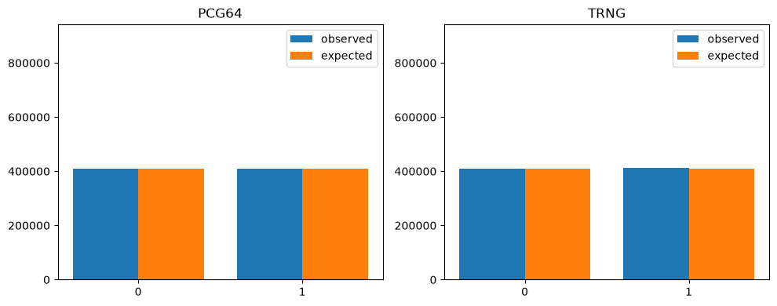
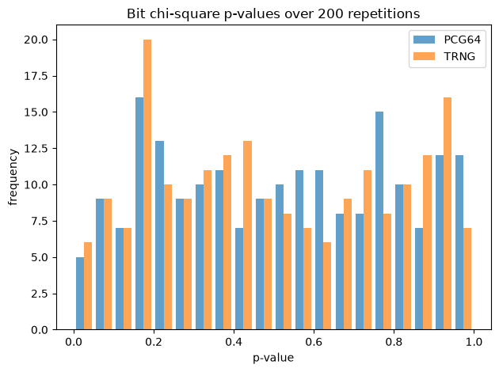
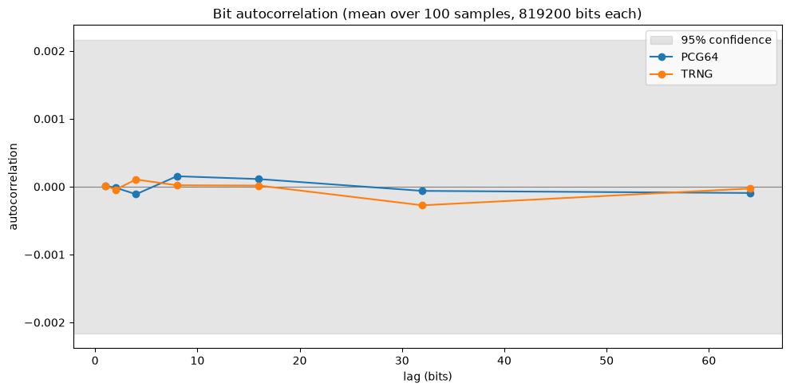
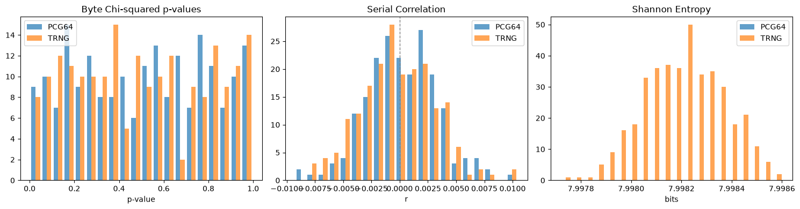
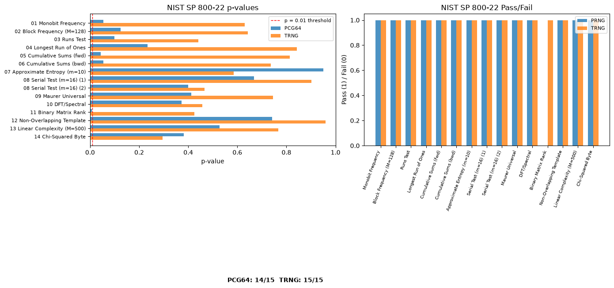

#+PROPERTY: header-args:python :kernel tutorials :async yes :results output :exports both
#+PROPERTY: header-args:python :session hello
#+PROPERTY: header-args:python+ :async yes

* New statistics

#+BEGIN_SRC python :kernel tutorials :tangle "new_statistics.py"
import os
import pandas as pd
import seaborn as sns
from scipy import stats
from scipy.stats import skew, kurtosis, wasserstein_distance, chisquare, norm
import matplotlib.pyplot as plt
from collections import deque
import numpy as np
import requests as req
from ast import literal_eval

#+END_SRC

#+RESULTS:

#+BEGIN_SRC python :kernel tutorials :tangle "new_statistics.py"
PRNG = "pcg64"
PROJECT_ROOT_DIR = "./."
BASE_IMAGES_PATH = os.path.join(PROJECT_ROOT_DIR, "images", PRNG)
os.makedirs(BASE_IMAGES_PATH, exist_ok = True)

def save_figure(fig_id, image_path, tight_layout = True, fig_extension = "png", resolution = 300):
    path = os.path.join(image_path, fig_id + "." + fig_extension)
    print(f"Saving figure {fig_id}")
    if tight_layout:
        plt.tight_layout()
    plt.savefig(path, format = fig_extension, dpi = resolution)
#+END_SRC

#+RESULTS:

** Project setup

#+BEGIN_SRC python :kernel tutorials :tangle "new_statistics.py"
class Qrng:
    def __init__(self, domain) -> None:
        self.__domain = domain
        self.__api_int = "https://{}/api/2.0/int".format(self.__domain)
        self.__api_bytes ="https://{}/api/2.0/streambytes".format(self.__domain)

    def qrand_int(self, low, hi, samples) -> list[int]:
        session = req.Session()
        payload = {"min": low, "max": hi, "quantity": samples}
        response = session.get(self.__api_int, params = payload)
        res = literal_eval(response.text)
        return res

    def qrand_bytes(self, size) -> bytes:
        session = req.Session()
        payload = {"size": size}
        response = session.get(self.__api_bytes, params = payload)
        
        return response.content

def qrandbytes(size=1024) -> bytes:
    qrng = Qrng("random.cs.upt.ro")
    values = qrng.qrand_bytes(size)
    return values
    
def qrandint(l, h, n, pool_size = 100000) -> np.array:
    if not hasattr(qrandint, "ivalues"):
       qrandint.ivalues = {}

    key = str(l) + str(h)
    if key in qrandint.ivalues:
        # found the key
        values = qrandint.ivalues[key]
        if len(values) == 0 or len(values) < n:
            qrng = Qrng("random.cs.upt.ro")
            values = qrng.qrand_int(l, h, (n + pool_size))
            qrandint.ivalues[key] += values
        else:
            pass
    else:
        qrng = Qrng("random.cs.upt.ro")
        qrandint.ivalues[key] = qrng.qrand_int(l, h, (n + pool_size))

    outvals = qrandint.ivalues[key][:n]
    del qrandint.ivalues[key][:n]
    return np.array(outvals, dtype = np.uint32)
#+END_SRC

#+RESULTS:

#+BEGIN_SRC python :kernel tutorials :tangle "statistics.py"
def randint(l, h, n, generator="pcg64", seed=None, dtype = np.uint32):
    generators = {
        "pcg64": np.random.PCG64,
        "mt19937": np.random.MT19937,
        "philox": np.random.Philox,
        "sfc64": np.random.SFC64,
    }
    if generator not in generators:
        raise ValueError(f"Unknown generator: {generator}. Choose from {list(generators.keys())}")
    rng = np.random.default_rng(generators[generator](seed))
    return rng.integers(l, h, size=n, dtype=dtype)
#+END_SRC
#+RESULTS:

#+BEGIN_SRC python :kernel tutorials :tangle "new_statistics.py"
BYTE_STREAM_SIZE = 102400
#+END_SRC

#+RESULTS:

** Binary values

#+BEGIN_SRC python :kernel tutorials :tangle "new_statistics.py"
trng_bytes = qrandbytes(BYTE_STREAM_SIZE)
prng_bytes = randint(0, 256, BYTE_STREAM_SIZE, generator=PRNG, dtype=np.uint8).tobytes()
#+END_SRC

#+RESULTS:

** Bit frequency

#+BEGIN_SRC python :kernel tutorials :tangle "new_statistics.py"

def bytes_to_bits(data: bytes) -> np.ndarray:
    return np.unpackbits(np.frombuffer(data, dtype = np.uint8))

def bit_frequency(data: bytes) -> dict:
    bits = bytes_to_bits(data)
    counts = np.bincount(bits)
    return {"0": int(counts[0]), "1": int(counts[1])}

prng_bit_freq = bit_frequency(prng_bytes)
prng_bit_stream_len = len(bytes_to_bits(prng_bytes))

trng_bit_freq = bit_frequency(trng_bytes)
trng_bit_stream_len = len(bytes_to_bits(trng_bytes))
print(f"{PRNG.upper()} bit frequency: {prng_bit_freq}")
print(f"{PRNG.upper()} fraction of 1s: {prng_bit_freq['1']/prng_bit_stream_len}")
print(f"TRNG bit frequency: {trng_bit_freq}")
print(f"TRNG fraction of 1s: {trng_bit_freq['1']/trng_bit_stream_len}")
#+END_SRC

#+RESULTS:
: PCG64 bit frequency: {'0': 408924, '1': 410276}
: PCG64 fraction of 1s: 0.5008251953125
: TRNG bit frequency: {'0': 408286, '1': 410914}
: TRNG fraction of 1s: 0.50160400390625

#+BEGIN_SRC python :kernel tutorials :tangle "new_statistics.py"
streams = {
    PRNG.upper(): (prng_bit_freq, prng_bit_stream_len),
    "TRNG": (trng_bit_freq, trng_bit_stream_len),
}

fig, axes = plt.subplots(1, 2, figsize = (10, 4))
x = np.arange(2)
for ax, (name, (freq, bit_len)) in zip(axes, streams.items()):
    observed = [freq["0"], freq["1"]]
    expected = [bit_len / 2, bit_len / 2]
    chi2_stat, p_value = chisquare(observed, expected)
    print(f"{name}: chi2 = {chi2_stat:.4f}, p-value = {p_value:.4f}")
    ax.bar(x - 0.2, observed, 0.4, label = "observed")
    ax.bar(x + 0.2, expected, 0.4, label = "expected")
    ax.set_xticks(x)
    ax.set_xticklabels(["0", "1"])
    ax.set_ylim(0, bit_len * 1.15)
    ax.set_title(name)
    ax.legend()

save_figure("bit_chisquare", BASE_IMAGES_PATH)
#+END_SRC

#+RESULTS:
:RESULTS:
: PCG64: chi2 = 2.2313, p-value = 0.1352
: TRNG: chi2 = 8.4306, p-value = 0.0037
: Saving figure bit_chisquare

:END:

#+BEGIN_SRC python :kernel tutorials :tangle "new_statistics.py"
NUM_REPETITIONS = 200

prng_p_values = []
trng_p_values = []

for _ in range(NUM_REPETITIONS):

    trng_bytes = qrandbytes(BYTE_STREAM_SIZE)

    prng_bytes = randint(0, 256, BYTE_STREAM_SIZE, generator=PRNG, dtype=np.uint8).tobytes()
    
    prng_bit_freq = bit_frequency(prng_bytes)
    prng_bit_stream_len = len(bytes_to_bits(prng_bytes))

    trng_bit_freq = bit_frequency(trng_bytes)
    trng_bit_stream_len = len(bytes_to_bits(trng_bytes))

    streams = {
        PRNG.upper(): (prng_bit_freq, prng_bit_stream_len),
        "TRNG": (trng_bit_freq, trng_bit_stream_len),
    }

    for name, (freq, bit_len) in streams.items(): 
        observed = [freq["0"], freq["1"]]
        expected = [bit_len / 2, bit_len / 2]      
        _, p_value = chisquare(observed, expected)
        (prng_p_values if name == PRNG.upper() else trng_p_values).append(p_value)

fig, ax = plt.subplots()
ax.hist([prng_p_values, trng_p_values], bins = 20, label = [PRNG.upper(), "TRNG"], alpha = 0.7)
ax.set_xlabel("p-value")
ax.set_ylabel("frequency")
ax.set_title(f"Bit chi-square p-values over {NUM_REPETITIONS} repetitions")
ax.legend()
save_figure("bit_pvalue_histogram", BASE_IMAGES_PATH)

print(f"{PRNG.upper()} mean p-value: {np.mean(prng_p_values):.4f}, std: {np.std(prng_p_values):.4f} {np.mean(np.array(prng_p_values) < 0.05)}")
print(f"TRNG mean p-value: {np.mean(trng_p_values):.4f}, std: {np.std(trng_p_values):.4f} {np.mean(np.array(trng_p_values) < 0.05)}")
#+END_SRC

#+RESULTS:
:RESULTS:
: Saving figure bit_pvalue_histogram
: PCG64 mean p-value: 0.5145, std: 0.2855 0.025
: TRNG mean p-value: 0.5020, std: 0.2888 0.03

:END:

#+BEGIN_SRC python :kernel tutorials :tangle "new_statistics.py"
def autocorr(x, lag):
    return np.corrcoef(x[:-lag], x[lag:])[0, 1]

NUM_ACORR_SAMPLES = 100

lags = [1, 2, 4, 8, 16, 32, 64]
prng_acf_samples = []
trng_acf_samples = []

for _ in range(NUM_ACORR_SAMPLES):
    trng_bytes = qrandbytes(BYTE_STREAM_SIZE)
    rng = np.random.default_rng()
    prng_bytes = randint(0, 256, BYTE_STREAM_SIZE, generator=PRNG, dtype=np.uint8).tobytes()
    bits = 2.0 * bytes_to_bits(prng_bytes).astype(np.float64) - 1.0
    prng_acf_samples.append([autocorr(bits, lag) for lag in lags])

    bits = 2.0 * bytes_to_bits(trng_bytes).astype(np.float64) - 1.0
    trng_acf_samples.append([autocorr(bits, lag) for lag in lags])

prng_acf_mean = np.mean(prng_acf_samples, axis=0)
trng_acf_mean = np.mean(trng_acf_samples, axis=0)
n_bits = BYTE_STREAM_SIZE * 8
conf_bound = 1.96 / np.sqrt(n_bits)

print(f"{PRNG.upper()} mean ACF:")
for lag, acf in zip(lags, prng_acf_mean):
    print(f"  lag {lag}: {acf:.6f}")
print("TRNG mean ACF:")
for lag, acf in zip(lags, trng_acf_mean):
    print(f"  lag {lag}: {acf:.6f}")
print(f"95% confidence band: ±{conf_bound:.6f}")

fig, ax = plt.subplots(figsize=(10, 5))
ax.axhline(0, color="gray", lw=0.8)
ax.axhspan(-conf_bound, conf_bound, alpha=0.2, color="gray", label="95% confidence")
ax.plot(lags, prng_acf_mean, marker="o", label=f"{PRNG.upper()}")
ax.plot(lags, trng_acf_mean, marker="o", label="TRNG")
ax.set_xlabel("lag (bits)")
ax.set_ylabel("autocorrelation")
ax.set_title(f"Bit autocorrelation (mean over {NUM_ACORR_SAMPLES} samples, {n_bits} bits each)")
ax.legend()
save_figure("bit_autocorrelation", BASE_IMAGES_PATH)
#+END_SRC

#+RESULTS:
:RESULTS:
#+begin_example
PCG64 mean ACF:
  lag 1: 0.000013
  lag 2: -0.000015
  lag 4: -0.000112
  lag 8: 0.000154
  lag 16: 0.000112
  lag 32: -0.000062
  lag 64: -0.000093
TRNG mean ACF:
  lag 1: 0.000014
  lag 2: -0.000043
  lag 4: 0.000106
  lag 8: 0.000020
  lag 16: 0.000016
  lag 32: -0.000275
  lag 64: -0.000027
95% confidence band: ±0.002166
Saving figure bit_autocorrelation
#+end_example

:END:
** Byte-level tests

#+BEGIN_SRC python :kernel tutorials :tangle "new_statistics.py"
def shannon_entropy(data: bytes) -> float:
    counts = np.bincount(np.frombuffer(data, dtype=np.uint8), minlength=256)
    probs = counts / len(data)
    probs = probs[probs > 0]
    return -np.sum(probs * np.log2(probs))

def serial_correlation(data: np.ndarray) -> float:
    x, y = data[:-1].astype(float), data[1:].astype(float)
    if len(x) < 2:
        return 0.0
    return np.corrcoef(x, y)[0, 1]

NUM_BYTE_TESTS = 200

prng_chi2_pvalues = []
trng_chi2_pvalues = []
prng_sc_values = []
trng_sc_values = []
prng_entropies = []
trng_entropies = []

for _ in range(NUM_BYTE_TESTS):
    trng_bytes = qrandbytes(BYTE_STREAM_SIZE)

    prng_bytes = randint(0, 256, BYTE_STREAM_SIZE, generator=PRNG, dtype=np.uint8).tobytes()
    for name, stream in [(PRNG.upper(), prng_bytes), ("TRNG", trng_bytes)]:
        data = np.frombuffer(stream, dtype=np.uint8)

        observed = np.bincount(data, minlength=256)
        expected = np.full(256, len(stream) / 256)
        _, p = chisquare(observed, expected)
        (prng_chi2_pvalues if name == PRNG.upper() else trng_chi2_pvalues).append(p)

        r = serial_correlation(data)
        (prng_sc_values if name == PRNG.upper() else trng_sc_values).append(r)

        h = shannon_entropy(stream)
        (prng_entropies if name == "PRNG" else trng_entropies).append(h)

print("=== Byte Chi-squared ===")
print(f"{PRNG.upper()} mean p-value: {np.mean(prng_chi2_pvalues):.4f}, fail rate: {np.mean(np.array(prng_chi2_pvalues) < 0.05):.2%}")
print(f"TRNG mean p-value: {np.mean(trng_chi2_pvalues):.4f}, fail rate: {np.mean(np.array(trng_chi2_pvalues) < 0.05):.2%}")

print("=== Serial Correlation (r between consecutive bytes) ===")
print(f"{PRNG.upper()} mean r: {np.mean(prng_sc_values):.6f}, std: {np.std(prng_sc_values):.6f}")
print(f"TRNG mean r: {np.mean(trng_sc_values):.6f}, std: {np.std(trng_sc_values):.6f}")

print("=== Shannon Entropy (max 8.0 bits) ===")
print(f"{PRNG.upper()} mean: {np.mean(prng_entropies):.4f}, std: {np.std(prng_entropies):.4f}")
print(f"TRNG mean: {np.mean(trng_entropies):.4f}, std: {np.std(trng_entropies):.4f}")

fig, axes = plt.subplots(1, 3, figsize=(15, 4))

axes[0].hist([prng_chi2_pvalues, trng_chi2_pvalues], bins=20, label=[PRNG.upper(), "TRNG"], alpha=0.7)
axes[0].set_title("Byte Chi-squared p-values")
axes[0].set_xlabel("p-value")
axes[0].legend()

axes[1].hist([prng_sc_values, trng_sc_values], bins=20, label=[PRNG.upper(), "TRNG"], alpha=0.7)
axes[1].axvline(0, color="gray", ls="--", lw=1)
axes[1].set_title("Serial Correlation")
axes[1].set_xlabel("r")
axes[1].legend()

axes[2].hist([prng_entropies, trng_entropies], bins=20, label=[PRNG.upper(), "TRNG"], alpha=0.7)
axes[2].set_title("Shannon Entropy")
axes[2].set_xlabel("bits")
axes[2].legend()

plt.tight_layout()
save_figure("byte_level_tests", BASE_IMAGES_PATH)
#+END_SRC

#+RESULTS:
:RESULTS:
: === Byte Chi-squared ===
: PCG64 mean p-value: 0.5082, fail rate: 4.00%
: TRNG mean p-value: 0.5026, fail rate: 3.50%
: === Serial Correlation (r between consecutive bytes) ===
: PCG64 mean r: 0.000318, std: 0.003136
: TRNG mean r: -0.000246, std: 0.003316
: === Shannon Entropy (max 8.0 bits) ===
: PCG64 mean: nan, std: nan
: TRNG mean: 7.9982, std: 0.0002
: Saving figure byte_level_tests

:END:
*** NIST STS

#+BEGIN_SRC python :kernel tutorials :tangle "new_statistics.py"
from nist_sp800_22 import run_all_tests

NIST_BYTE_COUNT = 125_000  # 1M bits
NIST_CHUNK = 65536

def qrandbytes_chunked(total_bytes, chunk=NIST_CHUNK) -> bytes:
    chunks = []
    remaining = total_bytes
    while remaining > 0:
        n = min(chunk, remaining)
        chunks.append(qrandbytes(n))
        remaining -= n
    return b"".join(chunks)

nist_results = {}
for name in (PRNG.upper(), "TRNG"):
    if name == "TRNG":
        stream = qrandbytes_chunked(NIST_BYTE_COUNT)
    else:
        stream = randint(0, 256, NIST_BYTE_COUNT, generator=PRNG, dtype=np.uint8).tobytes()
    nist_results[name] = run_all_tests(stream, label=name)
#+END_SRC

#+RESULTS:
#+begin_example

======================================================================
  PCG64
======================================================================
  125,000 bytes = 1,000,000 bits (0.1s)

  --- NIST SP 800-22 Tests ---
  [PASS] 01 Monobit Frequency: p = 0.054104  (0.1s)
  [PASS] 02 Block Frequency (M=128): p = 0.125202  (0.0s)
  [PASS] 03 Runs Test: p = 0.099822  (0.1s)
  [PASS] 04 Longest Run of Ones: p = 0.233446  (0.1s)
  [PASS] 05 Cumulative Sums (fwd): p = 0.042670  (0.1s)
  [PASS] 06 Cumulative Sums (bwd): p = 0.053933  (0.1s)
  [PASS] 07 Approximate Entropy (m=10): p = 0.950762  (2.6s)
  [PASS] 08 Serial Test (m=16) (1): p = 0.667265  (6.7s)
  [PASS] 08 Serial Test (m=16) (2): p = 0.399057  (6.7s)
  [PASS] 09 Maurer Universal: p = 0.411506  (0.3s)
  [PASS] 10 DFT/Spectral: p = 0.373394  (0.2s)
  [FAIL] 11 Binary Matrix Rank: p = 0.007128  (2.2s)
  [PASS] 12 Non-Overlapping Template: p = 0.742326  (0.5s)
  [PASS] 13 Linear Complexity (M=500): p = 0.526872  (36.0s)

  --- Supplementary Tests ---
  [PASS] 14 Chi-Squared Byte: p = 0.381782  (0.0s)
  [INFO] 15 Compression Ratio: 1.000368  (0.0s)
  [PASS] 16 Serial Correlation: r = +0.000695
  [PASS] 17 Shannon Entropy: 7.998495 bits/byte

  === SUMMARY: 16/17 tests passed ===
      FAIL: 11 Binary Matrix Rank: 0.007127874559075577

======================================================================
  TRNG
======================================================================
  125,000 bytes = 1,000,000 bits (0.2s)

  --- NIST SP 800-22 Tests ---
  [PASS] 01 Monobit Frequency: p = 0.629806  (0.1s)
  [PASS] 02 Block Frequency (M=128): p = 0.642316  (0.0s)
  [PASS] 03 Runs Test: p = 0.441438  (0.2s)
  [PASS] 04 Longest Run of Ones: p = 0.841464  (0.1s)
  [PASS] 05 Cumulative Sums (fwd): p = 0.813865  (0.2s)
  [PASS] 06 Cumulative Sums (bwd): p = 0.736471  (0.2s)
  [PASS] 07 Approximate Entropy (m=10): p = 0.584908  (4.2s)
  [PASS] 08 Serial Test (m=16) (1): p = 0.902373  (8.9s)
  [PASS] 08 Serial Test (m=16) (2): p = 0.466372  (8.9s)
  [PASS] 09 Maurer Universal: p = 0.744742  (0.3s)
  [PASS] 10 DFT/Spectral: p = 0.457296  (0.2s)
  [PASS] 11 Binary Matrix Rank: p = 0.425221  (3.6s)
  [PASS] 12 Non-Overlapping Template: p = 0.959463  (0.6s)
  [PASS] 13 Linear Complexity (M=500): p = 0.767350  (36.5s)

  --- Supplementary Tests ---
  [PASS] 14 Chi-Squared Byte: p = 0.296159  (0.0s)
  [INFO] 15 Compression Ratio: 1.000368  (0.0s)
  [PASS] 16 Serial Correlation: r = +0.000600
  [PASS] 17 Shannon Entropy: 7.998458 bits/byte

  === SUMMARY: 17/17 tests passed ===
      No anomalies detected.
#+end_example

#+BEGIN_SRC python :kernel tutorials :tangle "new_statistics.py"
test_names = []
prng_pvals = []
trng_pvals = []
prng_pass = []
trng_pass = []

for key in nist_results[PRNG.upper()]:
    r = nist_results[PRNG.upper()][key]
    if "p_value" in r:
        test_names.append(key)
        prng_pvals.append(r["p_value"])
        prng_pass.append(r["passed"])
        trng_pvals.append(nist_results["TRNG"][key]["p_value"])
        trng_pass.append(nist_results["TRNG"][key]["passed"])

fig, axes = plt.subplots(1, 2, figsize=(14, 5))

y = np.arange(len(test_names))
axes[0].barh(y - 0.2, prng_pvals, 0.4, label=PRNG.upper(), alpha=0.8)
axes[0].barh(y + 0.2, trng_pvals, 0.4, label="TRNG", alpha=0.8)
axes[0].axvline(0.01, color="red", ls="--", lw=1, label="p = 0.01 threshold")
axes[0].set_yticks(y)
axes[0].set_yticklabels(test_names, fontsize=8)
axes[0].set_xlabel("p-value")
axes[0].set_title("NIST SP 800-22 p-values")
axes[0].legend(fontsize=8)
axes[0].invert_yaxis()

prng_passed = sum(prng_pass)
trng_passed = sum(trng_pass)
total = len(test_names)
axes[0].set_xlim(0, 1)
axes[0].text(0.95, -1, f"{PRNG.upper()}: {prng_passed}/{total}  TRNG: {trng_passed}/{total}",
             transform=axes[0].transAxes, ha="right", va="top", fontsize=10, fontweight="bold")

labels = [name.split(" ", 1)[1] if " " in name else name for name in test_names]
x = np.arange(len(labels))
width = 0.35
axes[1].bar(x - width/2, [1 if p else 0 for p in prng_pass], width, label="PRNG", alpha=0.8)
axes[1].bar(x + width/2, [1 if p else 0 for p in trng_pass], width, label="TRNG", alpha=0.8)
axes[1].set_xticks(x)
axes[1].set_xticklabels(labels, rotation=70, ha="right", fontsize=7)
axes[1].set_ylabel("Pass (1) / Fail (0)")
axes[1].set_title("NIST SP 800-22 Pass/Fail")
axes[1].legend(fontsize=8)

plt.tight_layout()
save_figure("nist_results", BASE_IMAGES_PATH)

print(f"\n{PRNG.upper()}: {prng_passed}/{total} tests passed")
print(f"TRNG: {trng_passed}/{total} tests passed")
if prng_passed < total:
    failed = [test_names[i] for i, p in enumerate(prng_pass) if not p]
    print(f"{PRNG.upper()} failed: {', '.join(failed)}")
if trng_passed < total:
    failed = [test_names[i] for i, p in enumerate(trng_pass) if not p]
    print(f"TRNG failed: {', '.join(failed)}")
#+END_SRC

#+RESULTS:
:RESULTS:
: Saving figure nist_results
: 
: PCG64: 14/15 tests passed
: TRNG: 15/15 tests passed
: PCG64 failed: 11 Binary Matrix Rank

:END:

